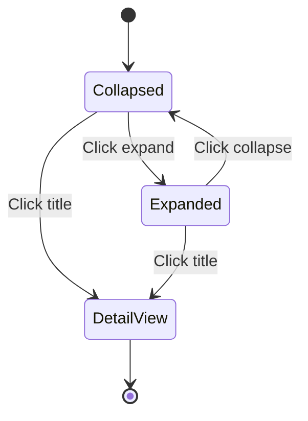

# Task Managing Interface Enhancements Specifications

## Overview
This document outlines the design enhancements for the task managing interface to address clutter in task cards, limited search/filtering capabilities, and improve usability. All designs use Tailwind CSS for responsiveness and maintain the existing zinc color palette and aesthetic.

## 1. Simplified Task Cards with Progressive Disclosure

### Current Issues
- Task cards display too much information simultaneously (title, subtitle, project, assignee, time tracked, multiple buttons)
- Information hierarchy is unclear
- Cards become visually overwhelming on smaller screens

### Proposed Design

#### Basic View (Collapsed)
- **Layout**: Compact card with essential information
- **Elements**:
  - Drag handle (⋮⋮)
  - Task title (truncated, clickable)
  - Priority indicator (colored dot: red=high, yellow=medium, gray=low)
  - Assignee avatar/initials (small circle)
  - Due date indicator (if within 7 days: "Due in X days" or "Overdue")
  - Status badge (small pill)
  - Quick actions (3-dot menu for expand/duplicate/delete)

#### Expanded View (Progressive Disclosure)
- **Trigger**: Click expand button or double-click card
- **Additional Elements**:
  - Subtitle (if present)
  - Project name
  - Time tracked
  - Idea/link previews (truncated)
  - Full action buttons (Start/Stop, Done/Undo, Open)
  - Custom buttons

#### Layout Changes
```html
<div class="task-card bg-zinc-950/35 border border-zinc-800/70 rounded-xl p-4 hover:bg-zinc-950/45">
  <div class="flex items-start gap-3">
    <div class="drag-handle">⋮⋮</div>
    <div class="flex-1 min-w-0">
      <div class="flex items-center gap-2 mb-2">
        <span class="priority-dot w-2 h-2 rounded-full bg-red-500"></span>
        <h3 class="font-medium truncate">Task Title</h3>
        <button class="expand-btn ml-auto">▼</button>
      </div>
      <div class="flex items-center gap-2 text-sm text-zinc-400">
        <span class="assignee-avatar">JD</span>
        <span>Due in 2 days</span>
        <span class="status-badge">In Progress</span>
      </div>
      <!-- Expanded content here -->
    </div>
  </div>
</div>
```

#### Interactivity
- Hover: Subtle background change
- Click title: Open detail view
- Click expand: Toggle expanded view with smooth animation
- Drag: Maintain existing drag functionality

#### Responsive Design
- Mobile: Stack elements vertically, reduce padding
- Tablet: Maintain horizontal layout
- Desktop: Full layout with hover states

## 2. Search Bar and Advanced Filters

### Current Issues
- Only project filter available
- No text search
- No advanced filtering by assignee, priority, due date

### Proposed Design

#### Search Bar Component
- **Position**: Above the Kanban columns, below view tabs
- **Layout**: Full-width input with search icon
- **Features**:
  - Real-time search as user types (debounced)
  - Placeholder: "Search tasks by title, description, or assignee..."
  - Clear button (×)

#### Advanced Filters
- **Trigger**: "Filters" button next to search bar
- **UI**: Dropdown/modal with filter options
- **Filter Options**:
  - Assignee: Multi-select dropdown with user list
  - Priority: Multi-select checkboxes (Low, Medium, High)
  - Due Date: Date range picker (From/To)
  - Status: Multi-select (Todo, In Progress, Done)
  - Project: Already exists, integrate if needed

#### Layout Changes
```html
<div class="search-filters mb-6">
  <div class="flex gap-3">
    <div class="flex-1 relative">
      <input type="text" placeholder="Search tasks..." class="w-full bg-zinc-950 border border-zinc-800 rounded-lg px-4 py-2 pl-10">
      <svg class="absolute left-3 top-2.5 w-4 h-4 text-zinc-400">search-icon</svg>
    </div>
    <button class="filters-btn bg-zinc-900 border border-zinc-800 rounded-lg px-4 py-2">Filters</button>
  </div>
  <!-- Active filters display -->
  <div class="active-filters mt-2 flex gap-2">
    <span class="filter-tag">Assignee: John</span>
    <span class="filter-tag">Priority: High</span>
  </div>
</div>
```

#### Interactivity
- Search: Filter tasks in real-time, highlight matching text
- Filters: Apply on selection, show active filters as removable tags
- Clear: Reset all filters with one click

#### Responsive Design
- Mobile: Stack search and filters vertically
- Tablet: Side-by-side with smaller widths
- Desktop: Full width with expanded filter options

## 3. Bulk Selection and Actions

### Current Issues
- No way to perform actions on multiple tasks simultaneously
- Individual task management is time-consuming

### Proposed Design

#### Bulk Selection UI
- **Trigger**: "Select" button in top-right of tasks page
- **Selection**: Checkboxes appear on each task card
- **Select All**: Checkbox in header to select/deselect all visible tasks
- **Selection Counter**: "X tasks selected" indicator

#### Bulk Actions Menu
- **Position**: Fixed bar at bottom when tasks selected
- **Actions**:
  - Change Status (dropdown: Todo/In Progress/Done)
  - Assign To (dropdown: user list)
  - Set Priority (dropdown: Low/Medium/High)
  - Set Due Date (date picker)
  - Archive/Delete (with confirmation)
  - Move to Project (dropdown)

#### Layout Changes
```html
<!-- Task card with checkbox -->
<div class="task-card">
  <input type="checkbox" class="task-checkbox mr-3">
  <!-- rest of card -->
</div>

<!-- Bulk actions bar -->
<div class="bulk-actions fixed bottom-0 left-0 right-0 bg-zinc-900 border-t border-zinc-800 p-4">
  <div class="flex items-center justify-between">
    <span>3 tasks selected</span>
    <div class="flex gap-2">
      <select class="action-dropdown">
        <option>Change Status</option>
      </select>
      <button class="apply-btn">Apply</button>
    </div>
  </div>
</div>
```

#### Interactivity
- Selection: Checkboxes update counter and show/hide bulk bar
- Actions: Apply to all selected tasks with confirmation for destructive actions
- Feedback: Toast notifications for success/failure

#### Responsive Design
- Mobile: Full-width bar, stack actions vertically if needed
- Desktop: Compact layout with multiple action dropdowns

## 4. Tabbed Task Detail Form

### Current Issues
- All fields in one long form, overwhelming
- Related information (time tracking, links) mixed with core details
- Poor organization for complex tasks

### Proposed Design

#### Tab Structure
- **Details Tab**: Core task information (title, description, status, priority, assignee, due date)
- **Time Tracking Tab**: Time entries, manual entry, reports
- **Links Tab**: Manage task links
- **Automation Tab**: Task buttons and automation rules (if applicable)
- **History Tab**: Change log and comments

#### Layout Changes
```html
<div class="task-detail">
  <!-- Tab navigation -->
  <div class="tabs border-b border-zinc-800 mb-6">
    <button class="tab active">Details</button>
    <button class="tab">Time Tracking</button>
    <button class="tab">Links</button>
  </div>

  <!-- Tab content -->
  <div class="tab-content">
    <div class="tab-pane active" id="details">
      <!-- Details form -->
    </div>
    <div class="tab-pane" id="time-tracking">
      <!-- Time tracking interface -->
    </div>
  </div>
</div>
```

#### Interactivity
- Tab switching: Smooth transitions, maintain form state
- Save: Per-tab or global save button
- Validation: Real-time validation with error display

#### Responsive Design
- Mobile: Tabs become horizontal scroll or dropdown
- Tablet: Standard tab layout
- Desktop: Full tab navigation

## Implementation Considerations

### Backend Changes Required
- Search endpoint with filters
- Bulk action endpoints
- Tab-specific form handling

### Frontend Changes
- New components: SearchBar, FilterModal, BulkActions, TabbedForm
- State management for selections and filters
- HTMX integration for dynamic updates

### Accessibility
- Keyboard navigation for all new components
- Screen reader support for expanded content
- High contrast support

### Performance
- Debounced search to avoid excessive API calls
- Pagination for large task lists
- Lazy loading for expanded card content

## Mermaid Diagram: Task Card Progressive Disclosure Flow



## Next Steps
1. Review and approve this design specification
2. Create wireframes/mockups for visual validation
3. Implement components in code mode
4. Test responsiveness across devices
5. User testing and iteration